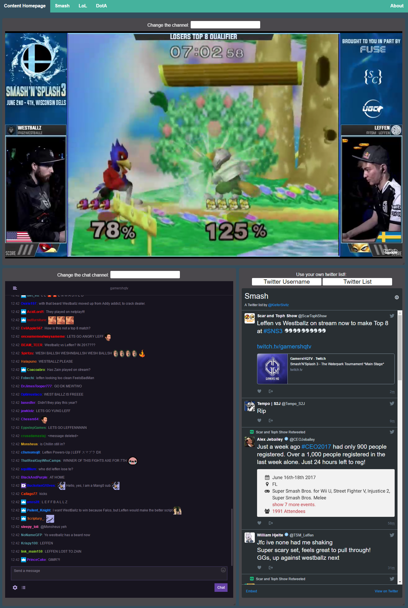

# Content Homepage

> Social media aggregator focused on integrating streaming channels with communities

## Project Information

This project began because I wanted to have a clean interface to have twitter and twitch together on one page because twitch chat has become unusable and twitter seemed to be the place that intelligent discussions were taking place.

The current vision for the site is to have many different community hubs playing top streams for each and twitter lists curated for each community.
Additionally I would like to integrate brackets or other such relevant information in the near future.

